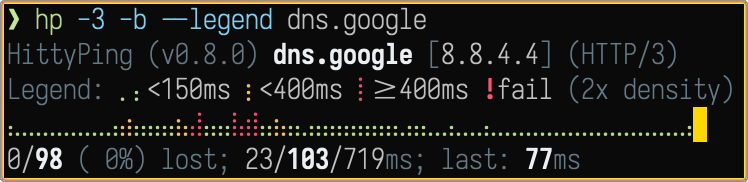
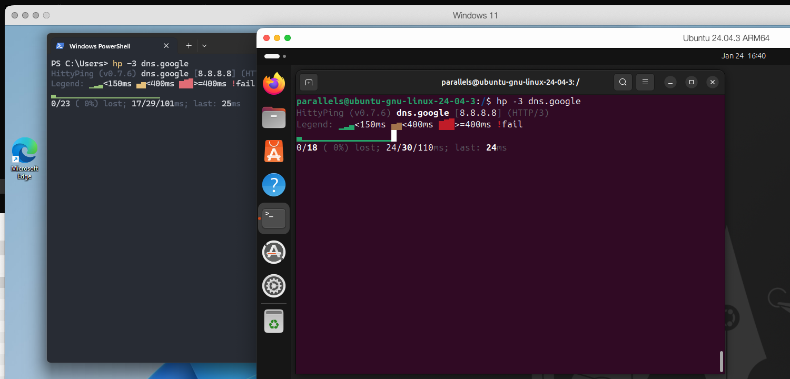

# `hp :// HittyPing`

<p align="center">
  <a href="https://github.com/colangelo/HittyPing/actions/workflows/ci.yml"></a>
  <a href="https://github.com/colangelo/HittyPing/releases"></a>
  <a href="https://goreportcard.com/report/github.com/colangelo/HittyPing"></a>
  <a href="https://scorecard.dev/viewer/?uri=github.com/colangelo/HittyPing"></a>
  <a href="LICENSE"></a>
</p>

PrettyPing-style HTTP(S) latency monitor with Unicode block visualization and color-coded response times.

<p align="center">
  
</p>

**New** in **v0.8.0** Braille characters visualization `-b / --braille` with 2x denser output:

<p align="center">
  
</p>

## Features

- PrettyPing-style Unicode block visualization
- Protocol selection: HTTP/1.1 (`-1`), HTTP/2 (`-2`), HTTP/3 (QUIC) (`-3`)
- Auto-downgrade HTTP/3 → 2 → 1 → plain on failures (`-d` secure, `-D` insecure)
- Live min/avg/max statistics
- Color-coded latency (green/yellow/red)
- Configurable color thresholds via flags or env vars
- Optional Braille characters visualization (`-b`) with 2x density
- Request count limit (`-c`) like `ping -c`
- Connection timeline on exit: color-coded UP/DOWN periods for diagnosing intermittent outages
- Summary at exit, including graceful `Ctrl+C`

## Installation

### Homebrew (macOS/Linux)

```bash
brew install colangelo/tap/hp
```

### Scoop (Windows)

```powershell
scoop bucket add colangelo https://github.com/colangelo/scoop-bucket
scoop install hp
```

### From source

```bash
go install github.com/colangelo/HittyPing@latest

# Or clone and build
git clone https://github.com/colangelo/HittyPing.git
cd HittyPing
go build -o hp .
```

### Docker

```bash
docker run --rm ghcr.io/colangelo/hp cloudflare.com
```

### From releases

Download the binary for your platform from [Releases](https://github.com/colangelo/HittyPing/releases).

**Verify download** (optional):

```bash
cosign verify-blob --signature hp-linux-amd64.sig --certificate hp-linux-amd64.pem \
  --certificate-oidc-issuer https://token.actions.githubusercontent.com \
  --certificate-identity-regexp 'github.com/colangelo/HittyPing' hp-linux-amd64
```

See [SECURITY.md](SECURITY.md) for full verification instructions.

## Usage

```bash
hp                              # Default: https://1.1.1.1
hp dns.google                   # Custom target (https:// auto-added)
hp -c 10 cloudflare.com         # Send 10 requests then exit
hp -i 500ms dns.google          # 500ms interval
hp -j 200ms cloudflare.com      # Add up to 200ms random jitter
hp -t 3s cloudflare.com         # 3 second timeout
hp --legend dns.google          # Show legend (hidden by default)
hp -q dns.google                # Quiet mode (hide header + legend)
hp -Q dns.google                # Silent mode (pure bar output)
hp -k https://self-signed.test  # Skip TLS verification
hp -1 httpbin.org               # Force HTTP/1.1 (plain HTTP)
hp -2 cloudflare.com            # Force HTTP/2 (fail if not negotiated)
hp -3 dns.google                # HTTP/3 (QUIC)
hp -3 -d example.com            # HTTP/3 with auto-downgrade on failures
hp -3 -D example.com            # Auto-downgrade including plain HTTP
hp -b cloudflare.com            # Braille mode (2x density)
hp -g 50 -y 100 cloudflare.com  # Custom thresholds (ms)
HTTPS_PROXY=socks5://host:1080 hp site  # Via SOCKS5 proxy
HTTP_PROXY=http://proxy:8080 hp -1 site # Via HTTP proxy
```

## Flags

| Flag | Long | Env Var | Default | Description |
|------|------|---------|---------|-------------|
| `-c` | `--count` | | 0 | Number of requests (0 = unlimited) |
| `-i` | `--interval` | | 1s | Request interval |
| `-j` | `--jitter` | | 0 | Max random jitter to add to interval (e.g., 200ms, 3s) |
| `-t` | `--timeout` | | 5s | Request timeout |
| `-b` | `--braille` | | false | Use braille visualization (2x density) |
| | `--legend` | | false | Show legend (hidden by default) |
| | `--noheader` | | false | Hide header line |
| `-q` | `--quiet` | | false | Hide header and legend |
| `-Q` | `--silent` | | false | Hide header, legend, and final stats |
| `-m` | `--min` | `HP_MIN` | 0 | Min latency baseline (ms) |
| `-g` | `--green` | `HP_GREEN` | 150 | Green threshold (ms) |
| `-y` | `--yellow` | `HP_YELLOW` | 400 | Yellow threshold (ms) |
| `-k` | `--insecure` | | false | Skip TLS certificate verification |
| `-1` | `--http` | | false | Use plain HTTP/1.1 |
| `-2` | `--http2` | | false | Force HTTP/2 (fail if not negotiated) |
| `-3` | `--http3` | | false | Use HTTP/3 (QUIC) |
| `-d` | `--downgrade` | | false | Auto-downgrade on 3 failures (secure only) |
| `-D` | `--downgrade-insecure` | | false | Auto-downgrade including plain HTTP |
| `-v` | `--version` | | | Show version |
| `-h` | `--help` | | | Show help |

## Visual Guide

- **Green** (▁▂▃): Fast - below green threshold
- **Yellow** (▄▅): Medium - between green and yellow thresholds
- **Red** (▆▇█): Slow - above yellow threshold
- **Red** ( ! ): Request failed

Block height scales within each color zone based on latency.

## Platform Support

Developed on macOS. Tested on Windows and Linux.



## Roadmap

See [ROADMAP.md](ROADMAP.md) for planned features including multi-target mode and potential TUI enhancements.

## License

MIT
