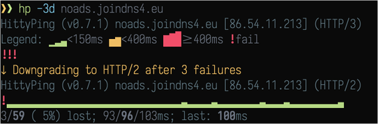

# hp - HittyPing

HittyPing is a prettyping-style HTTP(S) ping/latency monitor.
Visualizes response times using Unicode block characters with color coding.



## Features

- Prettyping-style Unicode block visualization
- Color-coded latency (green/yellow/red)
- Live min/avg/max statistics
- Protocol selection: HTTP/1.1 (`-1`), HTTP/2 (`-2`), HTTP/3 (`-3`)
- Auto-downgrade on failures (`-d` secure, `-D` insecure)
- Request count limit (`-c`) like `ping -c`
- Configurable thresholds via flags or env vars
- Optional HTTP/3 (QUIC) support via build tags
- Graceful Ctrl+C with final summary

## Installation

```bash
# Build from source
go build -o hp .

# Or with just
just install

# With HTTP/3 support (~10MB vs ~7.6MB default)
just install-http3
```

## Usage

```bash
hp                              # Default: https://1.1.1.1
hp cloudflare.com               # Custom target (https:// auto-added)
hp -c 10 cloudflare.com         # Send 10 requests then exit
hp -i 500ms cloudflare.com      # 500ms interval
hp -t 3s cloudflare.com         # 3 second timeout
hp -q cloudflare.com            # Quiet mode (hide legend)
hp -k https://self-signed.test  # Skip TLS verification
hp -1 httpbin.org               # Force HTTP/1.1 (plain HTTP)
hp -2 cloudflare.com            # Force HTTP/2 (fail if not negotiated)
hp -3 cloudflare.com            # HTTP/3 (QUIC) - requires http3 build
hp -3 -d example.com            # HTTP/3 with auto-downgrade on failures
hp -3 -D example.com            # Auto-downgrade including plain HTTP
hp -g 50 -y 100 cloudflare.com  # Custom thresholds (ms)
```

## Flags

| Flag | Long | Env Var | Default | Description |
|------|------|---------|---------|-------------|
| `-c` | `--count` | | 0 | Number of requests (0 = unlimited) |
| `-i` | `--interval` | | 1s | Request interval |
| `-t` | `--timeout` | | 5s | Request timeout |
| `-q` | `--nolegend` | | false | Quiet mode (hide legend) |
| `-m` | `--min` | `HP_MIN` | 0 | Min latency baseline (ms) |
| `-g` | `--green` | `HP_GREEN` | 150 | Green threshold (ms) |
| `-y` | `--yellow` | `HP_YELLOW` | 400 | Yellow threshold (ms) |
| `-k` | `--insecure` | | false | Skip TLS certificate verification |
| `-1` | `--http` | | false | Use plain HTTP/1.1 |
| `-2` | `--http2` | | false | Force HTTP/2 (fail if not negotiated) |
| `-3` | `--http3` | | false | Use HTTP/3 (requires http3 build) |
| `-d` | `--downgrade` | | false | Auto-downgrade on 3 failures (secure only) |
| `-D` | `--downgrade-insecure` | | false | Auto-downgrade including plain HTTP |
| `-v` | `--version` | | | Show version |
| `-h` | `--help` | | | Show help |

## Visual Guide

- **Green** (▁▂▃): Fast - below green threshold
- **Yellow** (▄▅): Medium - between green and yellow thresholds
- **Red** (▆▇█): Slow - above yellow threshold
- **Red !**: Request failed

Block height scales within each color zone based on latency.

## HTTP/3 Support

HTTP/3 (QUIC) is optional to keep the default binary small:

```bash
# Default build (~7.6MB) - no HTTP/3
go build -o hp .

# HTTP/3 build (~10MB)
go build -tags http3 -o hp .
```

HTTP/3 works with servers that support it (Cloudflare, Google, etc).

## License

MIT
